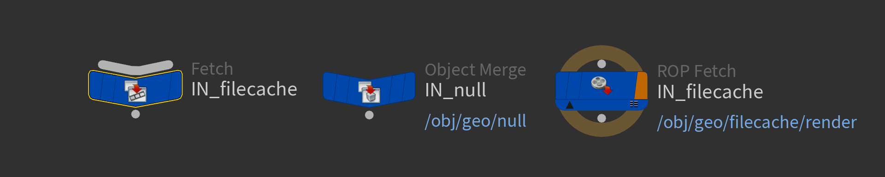

## 🚀 Installation

Let's get started! To install **PasteOBJ** and take advantage of its powerful features, follow these simple steps:

1. **Download** the `PasteOBJ` folder from this repository.
2. **Copy** the downloaded folder to the `$HOUDINI_USER_PREF_DIR` (`C:\Users\{Your User}\Documents\houdini{Your Houdini Version}`):
   > *Tip:* If you prefer, you can organize the folder inside subfolders, but make sure to remember the exact path for the next steps!

3. **Launch** Houdini.
4. Create a **Shelf** or use an existing one.
5. Add a new **Tool** and paste the following code in the `Script` tab (make sure to adjust the path according to your setup):
```python
import sys  
sys.path.append("Path where the PasteOBJ folder is located")  
   
from paste import pasteNode

pasteNode()
```

6. If you want to customize the **icon** of the tool, go to the `Options` tab and change the image. The default icon is available in:  
   `./PasteOBJ/icon/draft_icon.png`.

## ✨ Features

- **OBJ Context:** Copy any node and paste a reference object merge node to any object context network.
- **TOP Context:** Copy any file cache node and paste a reference fetch node to the render drive to any top context network.
- **ROP Context:** Copy any file cache node and paste a reference fetch node to the render drive to any rop context network.
